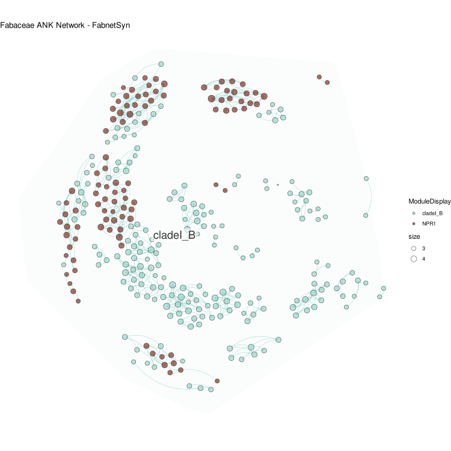
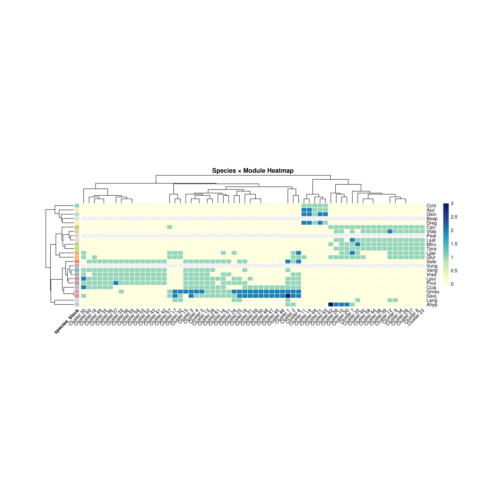

# FabnetSyn

FabnetSyn 用于Fabaceae同源区段（synteny）网络的构建与可视化，提供模块化布局、可配置配色方案，以及多种聚类算法选项。

## 安装

使用 devtools 安装本地包：

```r
# install.packages("devtools")
devtools::install_local("./FabnetSyn")
```

## 快速开始

```r
library(FabnetSyn)
res <- fabnetsyn_build_plot(
  edge_file = "Matched_Fabaceae_ANK_network.txt",
  node_group_file = "Fabaceae_tree_tip.id14",
  cluster_method = "infomap",                 # 或 "louvain" / "walktrap" / "leiden"
  cluster_params = list(nb.trials = 10),       # 传递给对应算法的参数
  palette = NULL,                              # 可传入命名向量或向量，映射到 Module
  output_file = "Fabaceae_ANK_Network_enhanced.png",
  width = 12, height = 12, dpi = 300
)
print(res$gg)
```

### 自定义配色

```r
pal <- c(
  "MajorModule" = "#E66F73",
  "ModuleB" = "#5c95e0",
  "ModuleC" = "#cd7560"
)
res <- fabnetsyn_build_plot(
  edge_file = "Matched_Fabaceae_ANK_network.txt",
  node_group_file = "Fabaceae_tree_tip.id14",
  palette = pal
)
```

## API 概览
- `read_network_tables(edge_file, node_group_file)` 读取边与节点分组表
- `build_fab_graph(network_data, node_groups)` 构建 igraph 并附加属性
- `cluster_graph(g, method, ...)` 多算法聚类并返回 membership
- `compute_subclade_layouts(g)` 子类群内部布局与权重
- `assemble_circular_layout(...)` 圆形空间填充布局
- `adjust_outer_ring(layout_kept, target_edge_radius)` 外圈回拉
- `force_optimize_layout(...)` 局部力导优化避免重叠
- `prepare_plot_data(g_kept, layout_kept)` 生成绘图数据
- `plot_fab_network(node.data, edge.data, palette)` 绘制 ggplot
- `fabnetsyn_build_plot(...)` 一键式流程（推荐）





## 许可
MIT


